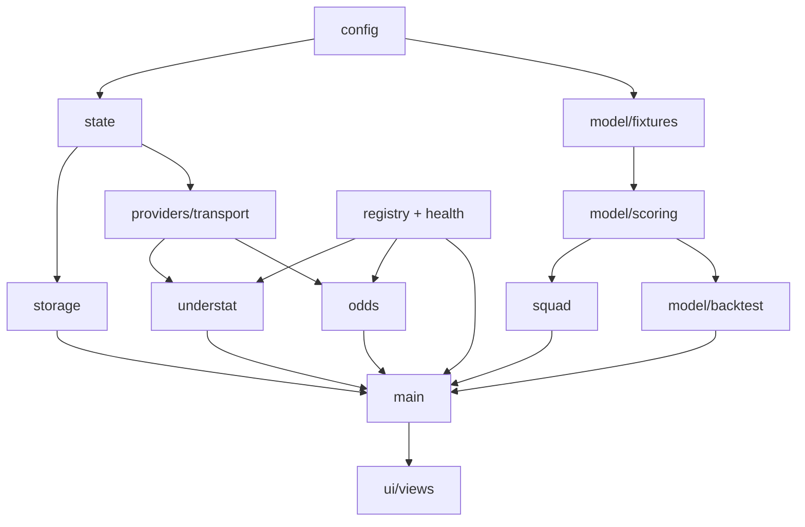
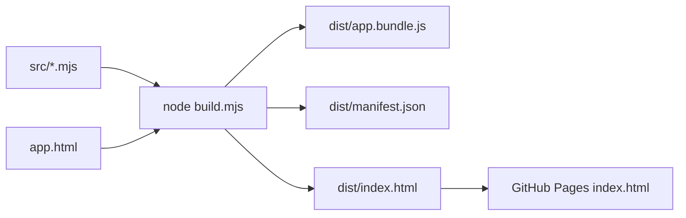

# ARCHITECTURE.md
Purpose: detailed technical architecture. Audience: developers/Claude before changing code.
Last updated: 2026-07-27. Related: PROJECT_CONTEXT.md, DATA_SOURCES.md, TESTING.md, SECURITY.md.

## Directory structure
```
app.html            UI shell/template (script tag replaced at build)
build.mjs           deterministic bundler (emits dist/)
run-tests.sh        build + full test suite
src/
  config.mjs        scoring constants, versions (MODEL/RULES/SCHEMA), ODDS_RULES
  util.mjs          $, num, clamp, fmt1, escapeHTML
  state.mjs         S (global state), KEEP field list, slim(), hydrate()
  storage.mjs       sget/sset (window.storage→localStorage fallback), saveCfg,
                    cachePut/cacheGet (versioned envelope)
  providers/
    retry.mjs       bounded transient-failure retry policies + safe endpoint labels
    validate.mjs    per-endpoint payload validation, fixture normalisation, issue collapse
    registry.mjs    six quality descriptors + seven-state runtime Provider Health
    transport.mjs   fetchT (timeout), RELAYS cascade, api(), fetchVia(), pool()
    common.mjs      NAME_ALIASES, mapTeamName
    understat.mjs   parseUnderstat, loadUnderstat (team last-6 xG/xGA only)
    odds.mjs        poissonOver, solveLambda, loadOdds (SEC-1: direct-only)
  model/
    fixtures.mjs    matchContext (3-layer blend), teamFixtures, multToDiff, runScore
    minutes.mjs     SHIM re-export (crude model lives in scoring; Stage 4 replaces)
    scoring.mjs     availability, per90, expectedMinutes, priceBaseline,
                    playerFixtureXP, projectXP + xp cache (xpOf/clearXP)
    xp.mjs          SHIM re-export of projection surface
    backtest.mjs    parseCSV, pearson, computeBacktest (pure, provenance), runBacktest (UI)
  squad.mjs         flagsFor, priceMomentum, newsAge, sellPrice, mySquad, bestXI
  main.mjs          loadAll orchestration + compact Provider Health strip
  ui/views.mjs      all views, wiring, init (monolithic by design until Stage 9)
tests/              harness.mjs + suites + golden.json, including provider-health transitions
tools/split.py      historical record of the Stage-2 extraction
docs/               this documentation set + AUDIT/STAGE records
dist/               BUILD ARTEFACT (bundle, index.html, manifest.json) — never edit
```

## Dependency flow

Bundler flattens everything into one scope in fixed ORDER (build.mjs); direct ES imports are the
contract for tests. Constraint: unique top-level names, no default exports, single-line imports.

## Provider Health architecture (D-16)
Runtime provider state is stored in-memory in `providers/registry.mjs`. The model is descriptive,
not a synthetic reliability score: Live, Cached, Stale, Fallback, Partial, Disabled and
Unavailable. Entries retain `lastSuccess`, calculated age, a technical note and a concise
consequence line. Staleness is derived when read, using FPL 30m during live GWs / 6h otherwise,
Understat 24h and odds 6h. `Disabled` is a neutral user choice and never ages into failure.

`main.mjs` maps the core FPL fresh/cache/error paths and renders the compact strip with DOM nodes.
`understat.mjs` and `odds.mjs` map their validation and fallback outcomes. The state is intentionally
session-scoped; the underlying FPL snapshot remains the persisted fallback source.

## Model architecture (documented fully in PROJECTION_MODEL.md)
Layered team strength → per-fixture context {xGF,xGA,cs,atk,def} → per-position component scoring →
projection cache → calibration multiplier → consumers (ranker, squad, captain, transfers, Ask
context). Layers: FPL strengths (base) ⊕ Understat last-6 (45%) ⊕ market odds (65% where quoted).

## Storage architecture
Keys: fpl:config, fpl:squad, fpl:leagues, fpl:calib (raw JSON via sget/sset) and fpl:cache
(versioned envelope: schemaVersion+season+fetchedAt; mismatch invalidates). window.storage inside
Claude artifacts, localStorage when hosted; both wrapped, both failure-tolerant. Provider Health
itself is not persisted.

## Build & deployment

Deterministic: same sources → same bytes; SHA-256 source hash + model/rules versions + BUILD_COMMIT
embedded (BUILD_INFO) and emitted as manifest. Deploy = upload dist/index.html.

## Testing strategy (detail in TESTING.md)
Characterisation runs against the built bundle via the DOM harness; direct-import unit and
resilience suites cover provider validation, retry and Provider Health transitions. Golden
snapshots retain an expected-to-change quarantine keyed to AUDIT issue ids.

## Future serverless architecture (planned, not built)
Cloudflare Pages/Netlify: static app unchanged; per-provider base URL flips to /api/<provider>;
functions hold secrets in env vars, add origin checks, rate limiting, schema validation server-side;
relays deleted; Anthropic key becomes possible. Trigger: the day hosted AI is wanted (DECISIONS D-08).
